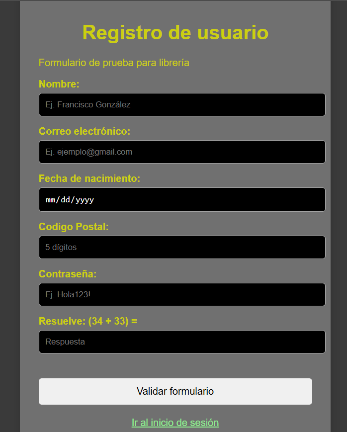
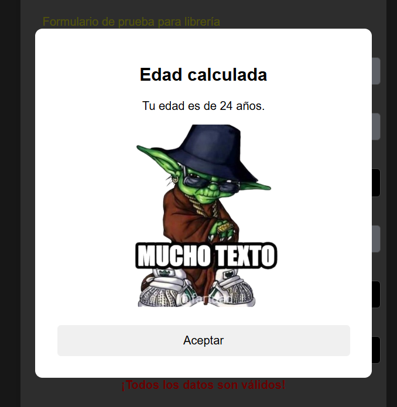
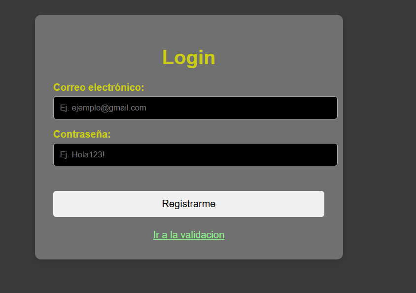

# Librería JavaScript de Utilidades

## Portada

**Nombre:** Francisco Javier González Santiago

**Proyecto:** Librería JavaScript de utilidades para formularios

### Descripción

Este proyecto consiste en una librería desarrollada en JavaScript que contiene diferentes funciones reutilizables para la validación y procesamiento de datos utilizados en formularios web.

La librería busca facilitar la validación de información ingresada por los usuarios, evitando tener que escribir nuevamente las mismas funciones en diferentes páginas.

Entre las funciones disponibles se encuentran la validación de correos electrónicos, validación de textos, validación de longitud de números, cálculo de edad, comprobación de mayoría de edad y validación de contraseñas.

La librería es utilizada en un formulario de registro y en una página de inicio de sesión para demostrar su funcionamiento y reutilización.

---

## Estructura del proyecto

```text
Actividad 2/
│
├── README.md
├── index.html
├── login.html
│
├── css/
│   └── styles.css
│
├── js/
│   └── utileria.js
│   └── validar.js
│   └── validarLogin.js
│
└── img/
│   └── bolaAmarilla.png
│   └── muchoTexto.png
│   └── captura1.png
│   └── captura2.png
│   └── captura3.png
│   └── captura4.png
```

---

## Instalación

Para utilizar la librería, se debe incluir el archivo `utileria.js` dentro del documento HTML mediante la etiqueta `<script>`.

```html
<script src="js/utileria.js"></script>
```

Una vez incluido el archivo, las funciones de la librería pueden utilizarse directamente desde JavaScript.

---

## Funciones disponibles

### 1. validarCorreo()

Valida si una cadena de texto tiene un formato básico de correo electrónico.

#### Ejemplo:

```javascript
validarCorreo("ejemplo@correo.us") //true
validarCorreo("ejemplo malo.s en") //false
```
---

### 2. soloLetras()

Comprueba que un texto contenga únicamente letras. También permite vocales acentuadas, la letra Ñ y espacios.

#### Ejemplo:

```javascript
soloLetras("Tecnologico de Oaxaca") //true
soloLetras("Teçnologico 12@___us") //false
```

---

### 3. validarLongitud()

Comprueba que un número tenga exactamente la cantidad máxima de dígitos indicada.

#### Ejemplo:

```javascript
validarLongitud("12345",5) //true
validarLongitud("12345", 8) //false
```

---

### 4. calcularEdad()

Calcula la edad de una persona utilizando su fecha de nacimiento.

#### Ejemplo:

```javascript
calcularEdad(24-01-2000) //26
```

La edad obtenida dependerá de la fecha actual.

---

### 5. esMayorDeEdad()

Determina si una persona tiene 18 años o más utilizando su fecha de nacimiento.

#### Ejemplo:

```javascript
esMayorDeEdad(24-01-2000); //true
esMayorDeEdad(02-11-2030); //false
```
---

### 6. validarPassword()

Comprueba que una contraseña tenga mínimo 8 caracteres, una letra mayúscula, una letra minúscula, un número y un carácter especial.

#### Ejemplo:

```javascript
validarPassword("Ayudame123!"); //true
validarPassword("contrasena123"); //false
```

---

## Uso en el formulario

Las funciones de la librería son utilizadas en `index.html` para validar los datos ingresados por el usuario.

Por ejemplo, para validar el nombre:

```javascript
const nombre = document.getElementById("nombre").value;

if (!soloLetras(nombre)) {
    mensaje.textContent=("El nombre solo debe contener letras.");
}
```

Para validar el correo:

```javascript
const correo = document.getElementById("correo").value;

if (!validarCorreo(correo)) {
    mensaje.textContent=("El correo no es válido.");
}
```

También se utiliza `calcularEdad()` para obtener la edad del usuario:

```javascript
const edad = calcularEdad(fechaNacimiento);

return edad;
```

Y `esMayorDeEdad()` para comprobar si el usuario cumple con la mayoría de edad:

```javascript
if (esMayorDeEdad(fechaNacimiento)) {
    mensaje.textContent=("El usuario es mayor de edad.");
}
```

---

## Modal de edad

El formulario utiliza la función `calcularEdad()` para obtener la edad y posteriormente mostrarla mediante una ventana modal.

```javascript
const edad = calcularEdad(fechaNacimiento);

document.getElementById("resultadoEdad").textContent =
    "Tu edad es de " + edad + " años.";

document.getElementById("modalEdad").style.display = "flex";
```

De esta manera, la función de la librería se integra directamente con la interfaz de la página.

---

## Funciones adicionales

En esta sección se agregarán las dos funciones adicionales desarrolladas para la librería.

### 7. Validar Codigo postal

Determina si una cadena de numeros puede ser un codigo postal de 5 digitos especificamente

#### Ejemplo:

```javascript
validarCodigoPostal(12345); //true
validarCodigoPostal(1234); //false
```

---

### 8. Captcha mediante suma

Pide realizar una suma como una especie de captcha

#### Ejemplo:

```javascript
validarRobot(67) //true
validarRobot(66) //false
```

---

## Capturas de pantalla

A continuación se mostrarán capturas de pantalla que demuestran el funcionamiento de la librería desde el navegador.

### Campos a validar



### Validación completa



### Login



### Login Exitoso


---

## Video demostrativo

En el video se presenta el funcionamiento de la librería JavaScript, mostrando el problema que busca resolver, la manera en que se utilizan sus funciones y los resultados obtenidos mediante el formulario y el inicio de sesión.


---

Proyecto realizado para la materia de Programación Web.